## 1. AWS 설정

### 1) AWS 계정 생성

1. [AWS 공식 홈페이지](https://aws.amazon.com/)에 접속하여 **AWS 계정 생성(Create an AWS Account)**을 진행한다.

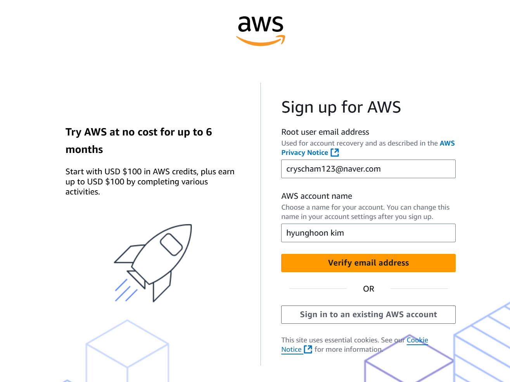

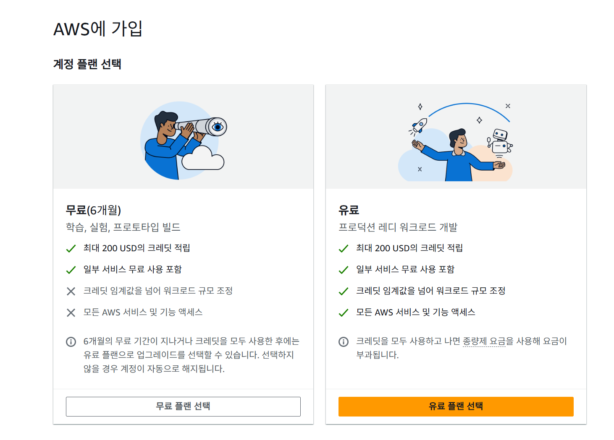

- 원래 1년동안 700시간 무료였는데 왜 200USD로 바뀐거 같다.
- 아무튼 우리 시뮬레이션 돌리는데에는 지장 없을 듯
- 다음에 뜨는 핸드폰 번호랑 주소는 적당히 입력하면 된다.

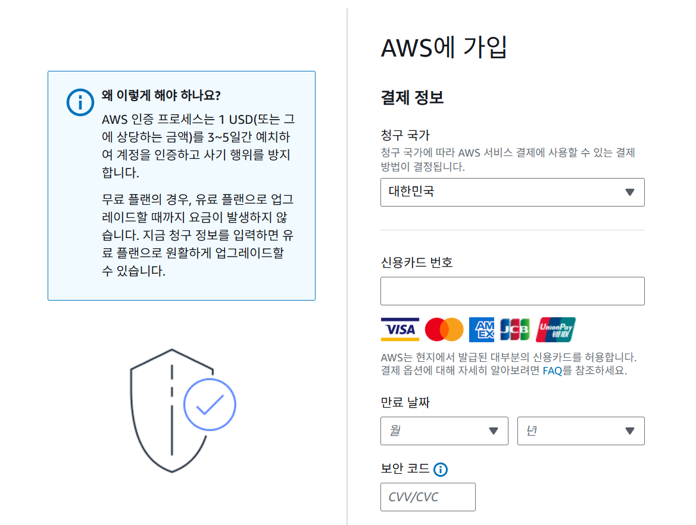

- 결제 정보를 입력해준다.
- 만약 과금될까봐 두렵다면, 카드 등록 후 바로 카드 해지를 한다.
- 그러면 돈이 안나간다.
- 사실 돈이 나갈 것 같으면 메일로 알림이 오기 때문에 너무 걱정 안해도 된다.

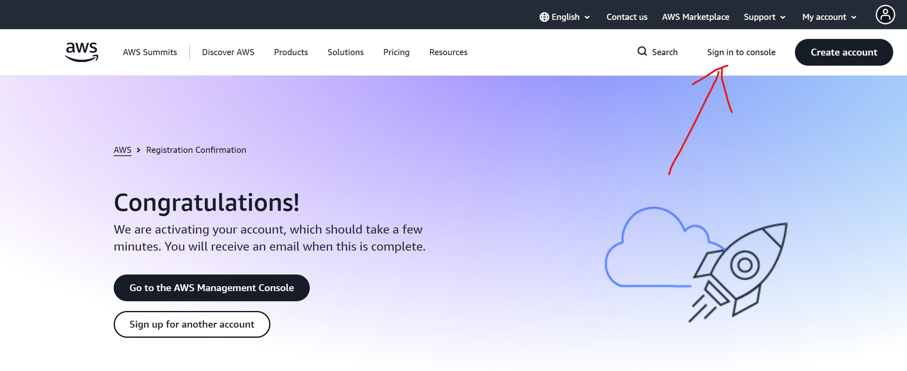

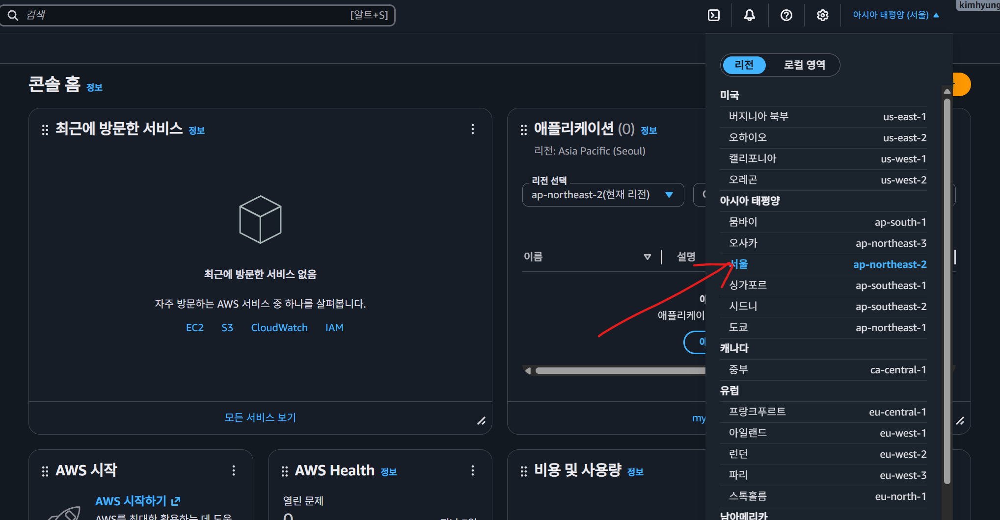

### 2) IAM 사용자 및 액세스 키 생성

- AWS한테 컴퓨터 달라고 하려면 신원 증명이 필요하다.
- 아래의 단계만 거치면 아주 간단하게 증명이 가능하다.

1. IAM 생성

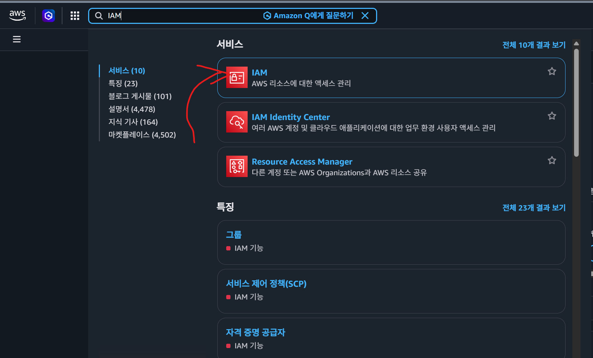

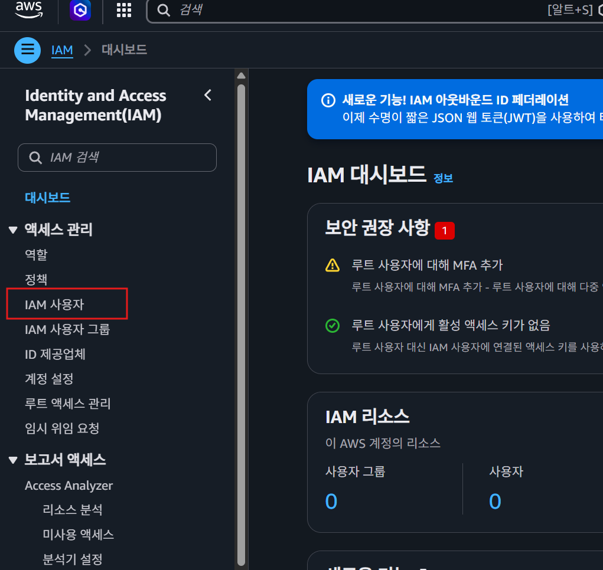


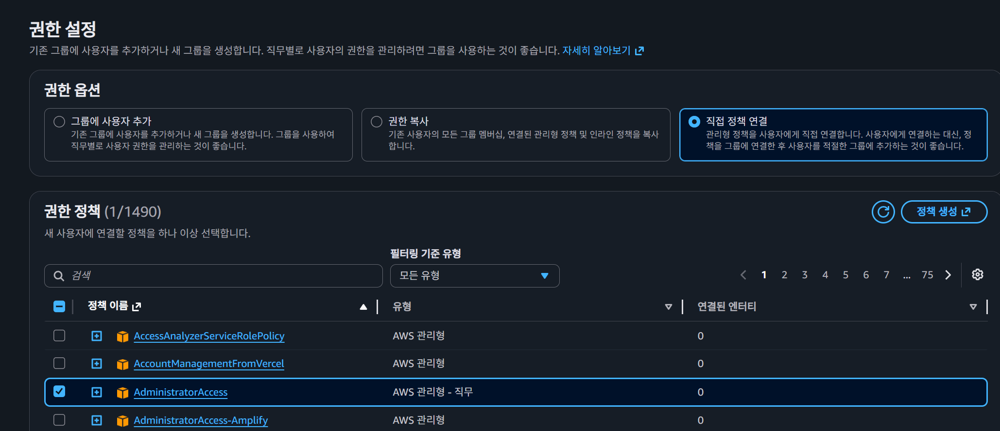

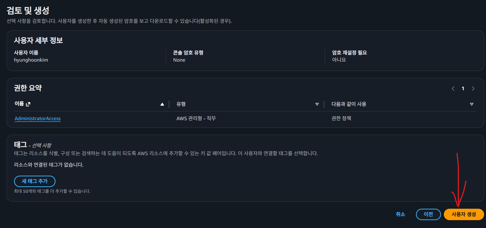

2. access key 발급

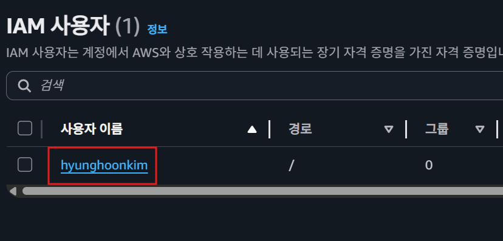

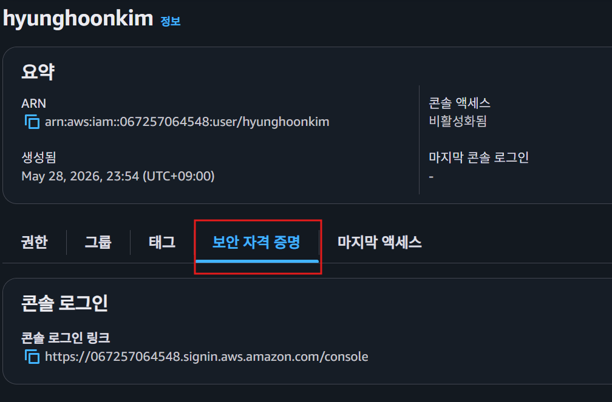

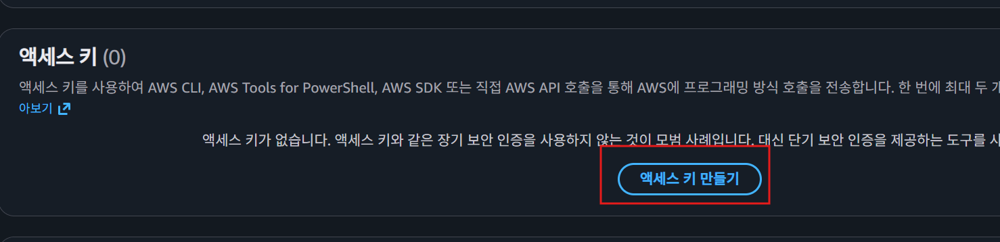

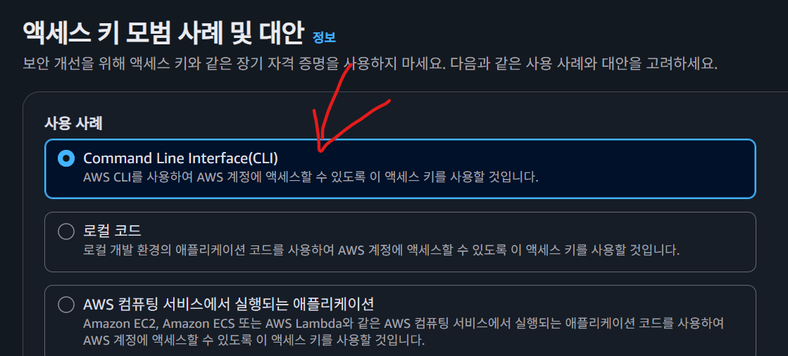

- 이제 생성이 되면 access key랑 secret key를 복사해서 각각 .env 파일의
- AWS_ACCESS_KEY_ID=
- AWS_SECRET_ACCESS_KEY=
- 여기에 붙여넣기 해준다.

설정 끝~

---

## 2. 로컬 개발 환경 준비

### Step 1. 세팅

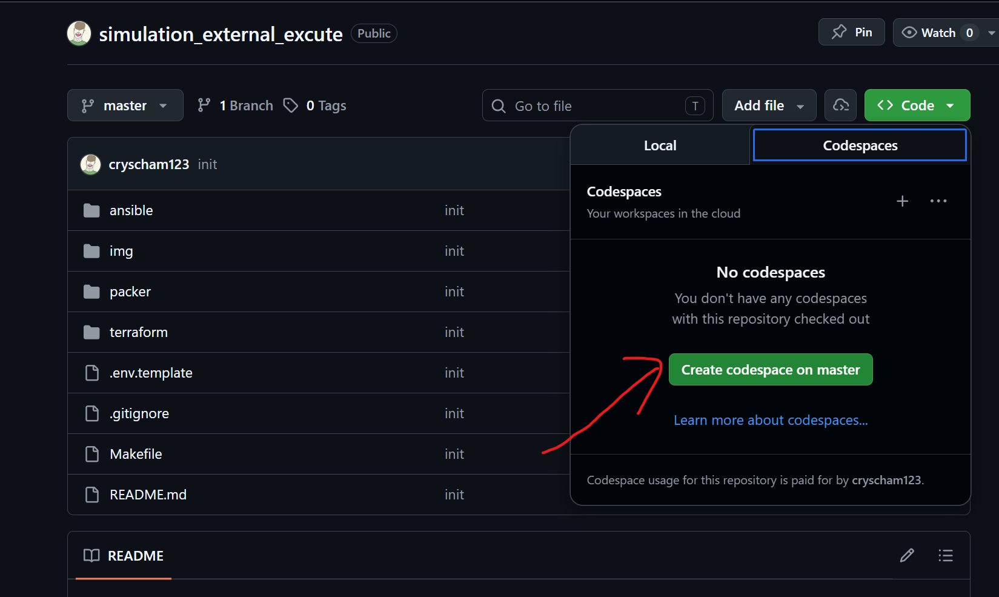

- window 환경에서는 진행하기 어려우니 github에서 제공해주는 codespace에서 진행하는 것을 추천한다.

### Step 2. Tool 설치

몇가지 필요한 tool들을 설치해야 한다.

```bash
sudo apt-get update && sudo apt-get install -y gnupg software-properties-common curl
wget -O- https://apt.releases.hashicorp.com/gpg | gpg --dearmor | sudo tee /usr/share/keyrings/hashicorp-archive-keyring.gpg > /dev/null
echo "deb [signed-by=/usr/share/keyrings/hashicorp-archive-keyring.gpg] https://apt.releases.hashicorp.com $(lsb_release -cs) main" | sudo tee /etc/apt/sources.list.d/hashicorp.list
sudo apt-get update && sudo apt-get install -y terraform packer ansible
sudo apt-get install -y python3-boto3 python3-botocore
```

### Step 3. 비밀번호 파일 생성

- 그런 다음 `echo "김형훈이 알려준 비밀번호" > .vault_pass` 이 명령어를 입력한다.
- 비밀번호는 민감한 정보이니 이건 물어보면 알려주겠다.

### Step 4. 시뮬레이션 파라미터 정의 (개수 = 머신 개수)

`envs/` 디렉토리에 원하는 머신 개수만큼 `.env` 파일을 복사하여 생성하고, 각 시뮬레이션에 필요한 파라미터 값들을 적어 넣는다.
* 예: `envs/.env.machine1`, `envs/.env.machine2` 생성
* 파일 개수(여기서는 2개)만큼의 EC2 머신이 자동으로 할당되어 실행된다.

### Step 5. 시뮬레이션 구동 AMI 빌드 (최초 1회)

```bash
make pre
```

- 이거는 처음 1회만 실행하면 된다.
- 오래 걸리는게 정상이다.

### Step 6. 시뮬레이션 시작

```bash
make simulation
```

* 머신 개수가 늘어난 경우(예: `envs/.env.machine3` 추가), 혹은 수정이 일어난 경우 반영.
- 시뮬레이션 코드가 수정되도 반영
- 이 명령어는 EC2 인스턴스 안에서 `simulation.service`를 시작한 뒤 종료된다.
- Codespace를 닫아도 시뮬레이션은 EC2에서 계속 실행된다.
- 시뮬레이션이 끝나면 결과를 Google Drive에 업로드하고, 업로드 성공한 로컬 결과 파일은 삭제한 뒤 EC2 인스턴스는 자동으로 중지된다.

진행 상태 확인:

```bash
make simulation-status
```

로그 확인:

```bash
make simulation-logs
```

- 인스턴스가 이미 자동 중지된 뒤에는 상태/로그 명령이 접속할 대상이 없어 실패할 수 있다.

### Step 7. 인프라 영구 삭제

```bash
make destroy
```

- 앞으로 시뮬레이션 더 실행할 일 없을 때 실행

## 여담

- ansible/data/ 디렉토리에 우리 시뮬레이션에서 사용할 데이터들을 넣어 놨다.
- 근데 그냥 우리 simulation 코드에 이제 데이터를 넣어서 관리하는게 더 편한거 같긴 하다.
- 처음에는 각자 데이터 조금씩 바꿔가며 테스트할걸 가정하고 그렇게 설계했었는데 고정된 데이터만 사용한다면 같이 github로 관리하는게 나을 듯
- 일단은 임시로 ansible/data/ 디렉토리에 넣어놨지만 나중에 simulation 코드로 옮겨서 관리하는게 더 좋아 보임
- 시뮬레이션이 돌아갈 때는 .env 파일의 BASE_DATA_PATH에 있는 경로로 데이터가 복사되서 돌아가도록 함.

## 여담2

- 현재 이 코드는 master 브랜치 기준의 simulation 코드를 실행함.
- 만약 다른 브랜치를 원한다면 ansible/server.yml 경로 파일의 Clone GitHub repository 단계에서 branch를 원하는 것으로 수정하면 된다.
